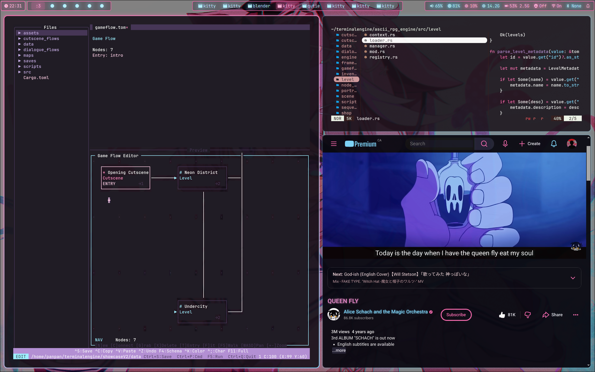
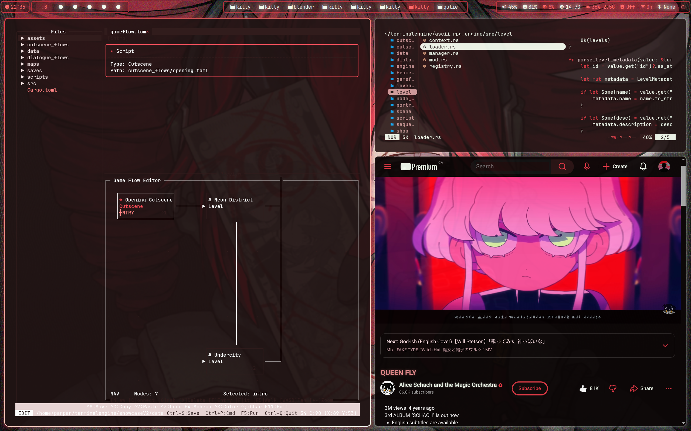

# a cooked fujoshi hyprland setup






## stuff

- **wm:** hyprland
- **bar:** waybar
- **terminal:** kitty
- **shell:** zsh + p10k
- **launcher:** rofi
- **browser:** qutebrowser
- **notifications:** mako
- **file manager:** yazi
- **editor:** micro / neovim

## themes

swaps colors across everything at once - astolfo (pink/blue), astolfo-kingdom (darker), teto (red/warm).

## install

```bash
bash <(curl -fsSL https://raw.githubusercontent.com/PanPanwastaken/dotfiles/master/install.sh)
```

wallpapers not included.
